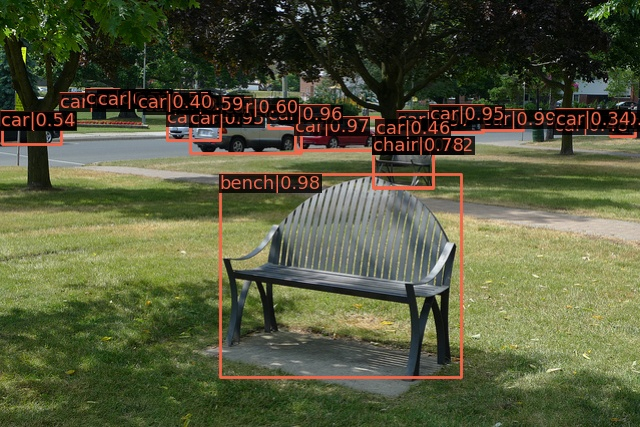
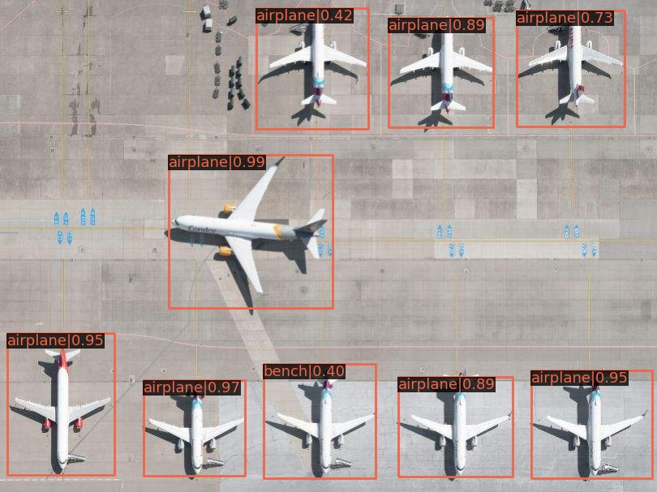
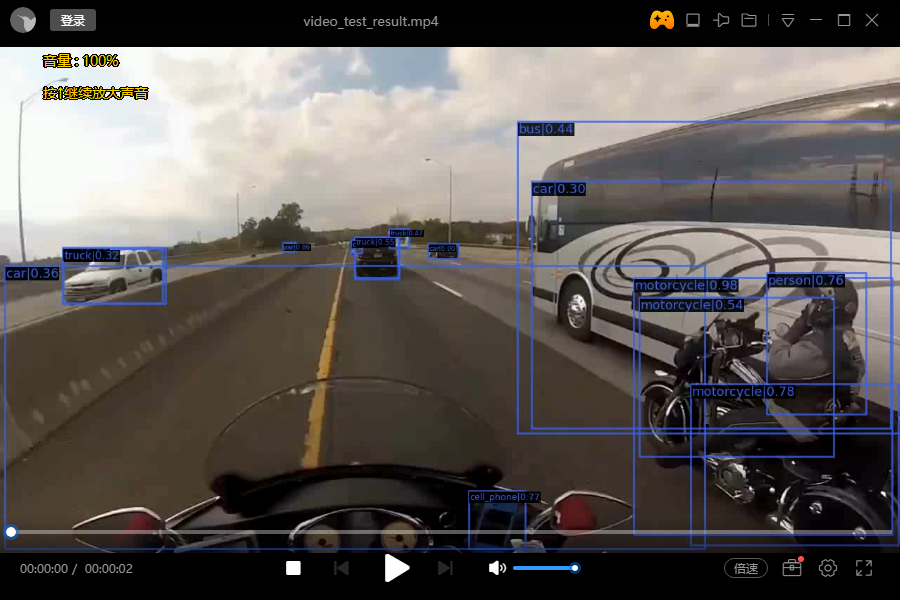

# cunt-focking-mmlabdetect
## Install

```
conda create -n openmmlab python=3.7 -y
conda activate openmmlab
```

```
conda install pytorch=1.3.1 cudatoolkit=9.2 torchvision=0.4.2 -c pytorch
```

```
pip install openmim
mim install mmdet
```

## ImageTest

```python
python demo/image_demo.py demo/demo.jpg configs/faster_rcnn/faster_rcnn_r50_fpn_1x_coco.py checkpoints/faster_rcnn_r50_fpn_1x_coco_20200130-047c8118.pth
```

## VideoTest

```python
python demo/video_demo.py demo/demo.mp4 configs/faster_rcnn/faster_rcnn_r50_fpn_1x_coco.py checkpoints/faster_rcnn_r50_fpn_1x_coco_20200130-047c8118.pth --out demo/video_test_result.mp4
```

## ImageTestResult





## ImageTestResult



## Why Did I call it a cunt ?

手动安装pycocotools：

直接使用pip安装

```
pip install pycocotools
```

显示：

```
Failed to build pycocotools
Installing collected packages: pycocotools
    Running setup.py install for pycocotools ... error
```

提示：

```
error: Microsoft Visual C++ 14.0 or greater is required. Get it with "Microsoft C++ Build Tools": https://visualstudio.microsoft.com/visual-cpp-build-tools/
```

原来pycocotools作者表示不支持windows
github上一位大佬制作了windows版本的：

```
https://github.com/philferriere/cocoapi
```


并且需要Visual C++ 2015 build tools 或者以上


并且选择默认选项


由于官网Visual C++ 2015 build tools 离线安装的问题涉及到与开发编码有关

会提示包损失或者数据损失

但是看到有的人开全局梯子可以解决，but it didn't work for me

所以看到CSDN上有一个大佬把所有包收集好了，打包成ISO，直接下载然后exe安装就可以了


度盘：

```
链接：https://pan.baidu.com/s/19F4YurwwZ5A9WF5txzMZoQ 提取码：ka7q
```

安装完毕后：

```
pip install git+https://github.com/philferriere/cocoapi.git#subdirectory=PythonAPI
```

提示：

```
Collecting git+https://github.com/philferriere/cocoapi.git#subdirectory=PythonAPI
  Cloning https://github.com/philferriere/cocoapi.git to c:\users\jayphonelin\appdata\local\temp\pip-req-build-_q375vqo
  Running command git clone -q https://github.com/philferriere/cocoapi.git 'C:\Users\JayphoneLin\AppData\Local\Temp\pip-req-build-_q375vqo'
  Resolved https://github.com/philferriere/cocoapi.git to commit 2929bd2ef6b451054755dfd7ceb09278f935f7ad
Building wheels for collected packages: pycocotools
  Building wheel for pycocotools (setup.py) ... done
  Created wheel for pycocotools: filename=pycocotools-2.0-cp38-cp38-win_amd64.whl size=77094 sha256=3bfc70c456436da29848abb45ef49b2ec842426543f74a40bf85e61411b8b7f3
  Stored in directory: C:\Users\JayphoneLin\AppData\Local\Temp\pip-ephem-wheel-cache-ir1wzooi\wheels\bd\1c\0d\8c82e1b9bc855b82e1eb53eadea4459efe171d2daf5a222701
Successfully built pycocotools
Installing collected packages: pycocotools
Successfully installed pycocotools-2.0
```


## How to train my own data in MMDetection  ? ?

简单来说就是准备好自己的数据。

转换为COCO或者PASCAL VOC数据集格式。

（1）在线转换：从CustomDataset继承一个新的数据集类，参考CocoDataset和VOCDataset重写load_annotations(self, ann_file)以及get_ann_infi(self,idx)两个方法。

（2）离线转换：直接将标注格式转换成需要的格式，存储为pickle或者JSON文件，然后使用CustomDataset处理数据。

以5个类别为例子：

在mmdet/datasets/my_dataset.py中添加代码：

```python
from .coco import CocoDataset
from .registry import DATASETS

@DATASETS.register_module
class MyDataset(CocoDataset):
    CLASSES = ('1','2','3','4','5')
```

在mmdet/datasets/__init__.py中添加代码：

```python
from .my_dataset import MyDataset
```

